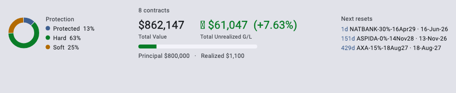
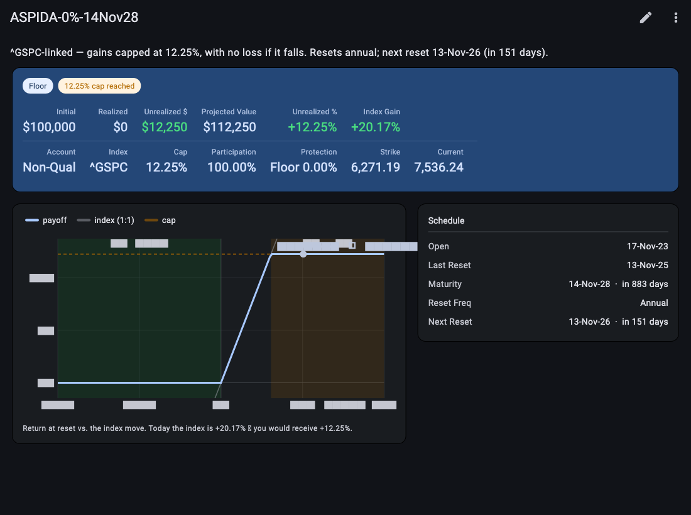
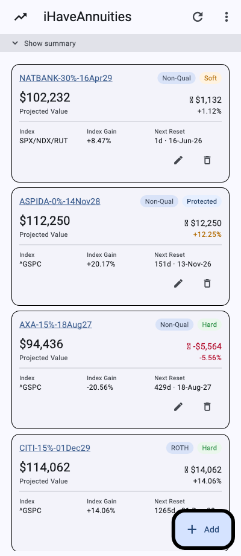

# iHaveAnnuities

Track structured products (annuities) that pay an index-linked return. The
**upside** is the index move — optionally scaled by a **participation rate** and
limited by a **cap** (or uncapped). The **downside** uses one of four protection
types (the tracker's *Floor Type* column):

1. **Floor** — *max-loss floor*: you lose only down to the floor, never worse. A **0% floor** means no loss at all; a −10% floor caps the loss at 10%.
2. **Hard** (Floor < 0%) — *buffer*: absorbs the first *X%* of losses; you lose only beyond it.
3. **Soft** (Floor < 0%) — *barrier*: fully protected unless the index breaches it, then the full loss applies.
4. **None** — *no downside protection*: you take the full index loss (for fixed-rate notes or a cap-but-no-floor structure).

**▶ Live app: https://jimzucker.github.io/iHaveAnnuities/** — a Flutter web app
(source in [`app/`](app/)). Load the sample portfolio, or import/export your own
tracker `.xlsx` (exports download as `export_ihaveannuities_YYYYMMDD.xlsx`); index
prices (S&P 500, Dow, Nasdaq Composite, Nasdaq‑100, Russell 2000) refresh daily at
5 PM ET on trading days, and a kept‑open tab re‑checks once a day after the close.
Light/dark, with a responsive card layout on phones.

Per‑contract performance shows a **Yield** (life‑to‑date CAGR) and the portfolio a
money‑weighted **XIRR**; your data stays in your browser and can be **encrypted at
rest** (see *Privacy & security*). A combined index chart can overlay **your
portfolio** (a principal‑weighted blend of its underlyings) against the indexes.
An in‑app **Guide** (menu) explains every column; rolled contracts can record an
optional **Inception** date so Yield/CAGR measures from the original investment,
not the latest roll (**Start Date**).


## Screens

Portfolio summary — protection mix, total value with money‑weighted **XIRR**, the
Principal / Realized / Unrealized composition bar, and upcoming resets:



Drill-down for one contract — payoff chart (cap / buffer / barrier reference
lines), key figures including life‑to‑date **Yield (CAGR)**, and terms:



On a phone, holdings render as cards:



## Privacy & security (optional)

Your portfolio lives only in this browser — no account, no server. You can turn on
**at‑rest encryption** (AES‑256‑GCM behind a passphrase) so the data is unreadable
without it, even via DevTools. Unlock with the **passphrase**, **Touch ID / Face ID**
(WebAuthn PRF), or a one‑time **recovery code**; a configurable "stay unlocked"
window (default 30 days) avoids re‑prompting. The Security screen and every
destructive action re‑verify identity (passphrase · Touch ID · recovery code), and
a first‑run wizard walks you through setup. It's **opt‑in** (default off) and fully
reversible.

There's **no email reset** — with no server, a lost passphrase *and* lost recovery
code means the encrypted local data can't be recovered, so keep an exported `.xlsx`
as your backup.

## Payoff math

Credited gain on the upside (per reset period):

```
indexReturn  = currentLevel / startLevel − 1
creditedGain = uncapped ? participation × indexReturn
                        : min(cap, participation × indexReturn)
```

Downside depends on the protection type (the tracker's **Floor** column):

```
Floor (incl. 0%)  → max-loss floor: lose only down to the floor (0% = no loss)
                    payoff = indexReturn ≥ 0 ? creditedGain : max(indexReturn, floor)
Hard       → buffer: absorbs the first |floor|%, lose 1:1 beyond
                    payoff = indexReturn ≥ 0 ? creditedGain : min(0, indexReturn − floor)
Soft       → barrier: protected unless breached, then full 1:1 loss
                    payoff = indexReturn ≥ 0 ? creditedGain
                            : (indexReturn ≥ floor ? 0 : indexReturn)

currentValue = principal × (1 + payoff)
```

The numeric difference matters: on a −28% index, a **−20% Hard** loses 8%, a
**−20% Floor** caps the loss at 20%, while a **−20% Soft** (breached) loses
the full 28%.

The projected value reinvests realized income into the base (matching the tracker):

```
projValue   = (initial + realized) × (1 + payoff)
unrealized  = (initial + realized) × payoff      # projValue = initial + realized + unrealized
```

## Example contracts — $100,000 starting principal

The nine illustrative contracts below match the table in the image above. They
are **modeled on real holdings** but normalized to a **$100,000** principal;
index returns/levels are illustrative (dates/days as of 14‑Jun‑26). The
`Floor Type` column is the downside-protection mechanism — **Floor** (max loss —
lose only down to the floor; 0% = no loss), **Hard** (first |floor|%
absorbed), **Soft** (barrier — full loss if breached). `$` values are in
$000s. Reset cadences collapse to **Once** (point-to-point), **Annual**, or
**Monthly**.

| Issuer | Index | Cap | Part. | Floor | Floor Type | Reset | Account | Index → Payoff | Proj Value |
| --- | --- | --- | --- | --- | --- | --- | --- | --- | --- |
| ASPIDA | ^GSPC | 12.25% | 100% | 0% | Floor | Annual | Non‑Qual | +18.00% → +12.25% | **$112.25** |
| AXA | ^GSPC | 65% | 100% | −15% | Hard | Once | Non‑Qual | −22.00% → −7.00% | **$93.00** |
| CITI | ^GSPC | Uncapped | 102% | −15% | Hard | Once | IRA | +30.00% → +30.60% | **$130.60** |
| HSBC | ^NDX | Uncapped | 92.25% | −15% | Hard | Once | IRA | +40.00% → +36.90% | **$136.90** |
| BNP | ^GSPC | Uncapped | 105% | −30% | Soft | Once | ROTH | −35.00% → −35.00% | **$65.00** |
| NATBANK | SPX/NDX/RUT | 13.25% cpn | 100% | −30% | Soft | Monthly | Non‑Qual | +8.47% → +1.10% | **$102.22** |
| AXA | ^NDX | 100% | 100% | −20% | Hard | Once | IRA | −15.00% → 0.00% | **$100.00** |
| CITI | ^GSPC | Uncapped | 100% | −15% | Hard | Once | ROTH | +12.00% → +12.00% | **$112.00** |
| MAREX | ^RUT | 20% | 100% | −10% | Floor | Once | Non‑Qual | −18.00% → −10.00% | **$90.00** |
| **Total** | | | | | | | | | **$941.97** |

What each row demonstrates:

- **Aspida** — gain above the 12.25% cap → capped; with a true 0% floor.
- **Axa 65%** — −22% index, −15% **buffer** absorbs 15% → lose only 7%.
- **Citi IRA** — uncapped with **102% participation** → +30% becomes +30.6%.
- **HSBC** — uncapped with **92.25% participation** (<100%) → +40% becomes +36.9%.
- **BNP** — −35% **breaches** the −30% **soft barrier** → full −35% loss.
- **NatBank** — monthly‑coupon **income note** on a **worst‑of** basket; soft −30% barrier.
- **Axa 100%** — −15% index sits **within** the −20% buffer → 0% loss.
- **Citi ROTH** — uncapped, 4‑year reset, modest +12% gain passes through.

### Use-case coverage

These nine cover every distinct case in the real tracker: **downside** —
Floor (max loss, incl. 0%), Hard (buffer), Soft (barrier); **cap** — capped + uncapped
(`9.99` sentinel); **participation** — <100% / 100% / >100%; **reset** —
Once / Annual / Monthly; **index** — SPX / NDX / RUT / worst‑of; **account**
— Non‑Qual / IRA / ROTH; plus a monthly‑coupon income note alongside the
standard indexed annuities.

## App (Flutter)

Cross-platform Flutter app in [`app/`](app/). The portfolio is stored as an
`.xlsx` in the Zucker Annuity Tracker format — import your real spreadsheet, edit,
and export; on web it persists in the browser between visits.

```bash
cd app
flutter pub get
flutter test --exclude-tags golden   # core 100% / data ≥95% coverage gate
flutter run -d chrome                # run the web app locally
```

- **Core** (`lib/core`): payoff engine + model (floor / Hard buffer / Soft barrier /
  None, participation, capped/uncapped, income notes; per‑contract Yield/CAGR).
- **Data** (`lib/data`): robust `.xlsx` reader/writer (the tracker schema), market
  feed, browser-persisted store, the **encrypted vault** (AES‑256‑GCM + WebAuthn
  biometric), and a money‑weighted **XIRR** solver.
- **Prices**: `data/market.json` (S&P 500, Dow, Nasdaq Composite, Nasdaq‑100,
  Russell 2000) is refreshed by a GitHub Action at 5 PM ET on trading days
  (Yahoo Finance, no API key); a kept‑open tab also re‑pulls once a day after the
  close. The web app is published to GitHub Pages.
- **Table**: sortable, with a compact/full column toggle and (on phones) a card
  layout; the drill‑down shows a payoff chart and key figures.
- The example/template spreadsheets and `docs/overview.png` are all generated from
  `docs/gen_overview.py` (`python3 docs/gen_overview.py`).
- The app screenshots in `docs/screenshots/` are generated by the golden harness:
  `flutter test --update-goldens --tags golden test/golden_screens_test.dart`,
  then copy `app/test/goldens/*.png` into `docs/screenshots/`. (Golden tests are
  tagged `golden` and excluded from the CI gate.)
- `scripts/session_stats.py` summarizes the Claude Code build sessions for this repo
  (token usage, prompt/turn counts, active vs. idle time, and estimated API cost)
  from the local transcripts; `--md` writes a Markdown report (see
  [`docs/SESSION_STATS.md`](docs/SESSION_STATS.md)) and `--rate-*` overrides the
  pricing assumptions.

## Built with Claude Code

This whole project was built with [Claude Code](https://claude.com/claude-code)
(Opus 4.8). The headline numbers from the build transcript:

| Metric | Value |
| --- | --- |
| Output tokens (produced content) | ~5.68 M |
| Grand total tokens (mostly cached context) | ~1.97 B |
| Prompts typed / assistant turns | ~212 / 4,471 |
| Active time (Claude working / you prompting) | ~18h 32m (11h 43m / 6h 48m) |
| Estimated metered-API cost (Opus 4.8 rates) | **≈ $1,291** |

The cost is dominated by cache reads; prompt caching saved ~$8,700 versus billing
that context as fresh input (~$9,700). At a flat Claude Code subscription this
build is effectively included, and the metered ~$1,291 is still well under the
cost of the multiple engineer-days the equivalent hand-built app would take. Full
breakdown — with pricing assumptions and caveats — in
[`docs/SESSION_STATS.md`](docs/SESSION_STATS.md), regenerated by
`python3 scripts/session_stats.py --md`.

## License

**Proprietary — all rights reserved.** This is **not** open-source software. It is
source-available for transparency and personal, non-commercial use only.
**Commercial use, redistribution, and modification require prior written approval**
from the author. See [`LICENSE`](LICENSE) and [`NOTICE`](NOTICE).

For a commercial license or any approval, contact Jim Zucker via
[github.com/jimzucker](https://github.com/jimzucker).

Third-party components remain under their own licenses. Flutter bundles the
aggregated notices with the build automatically; they're shown in-app via
*About → Open-source licenses* (`showLicensePage`). See [`licenses/`](licenses/).

Every source file carries an SPDX header:

```dart
// Copyright 2026 Jim Zucker
// SPDX-License-Identifier: LicenseRef-Proprietary
```

Copyright © 2026 Jim Zucker. All rights reserved.
