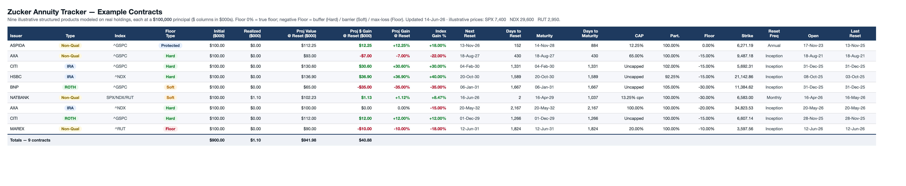

# iHaveAnnuities

Track structured products (annuities) that pay an index-linked return. The
**upside** is the index move — optionally scaled by a **participation rate** and
limited by a **cap** (or uncapped). The **downside** uses one of three protection
types (the tracker's *Floor Type* column):

1. **Protected** (Floor = 0%) — no loss in the period; principal protected each reset.
2. **Hard** (Floor < 0%) — *buffer*: absorbs the first *X%* of losses; you lose only beyond it.
3. **Soft** (Floor < 0%) — *barrier*: fully protected unless the index breaches it, then full loss applies.

**▶ Live app: https://jimzucker.github.io/iHaveAnnuities/** — a Flutter web app
(source in [`app/`](app/)). Load the sample portfolio, or import/export your own
tracker `.xlsx`; index prices (S&P 500, Dow, Nasdaq Composite, Nasdaq‑100,
Russell 2000) refresh daily at 5 PM ET on trading days, and a kept‑open tab
re‑checks once a day after the close. Light/dark, with a responsive card layout
on phones.



## Payoff math

Credited gain on the upside (per reset period):

```
indexReturn  = currentLevel / startLevel − 1
creditedGain = uncapped ? participation × indexReturn
                        : min(cap, participation × indexReturn)
```

Downside depends on the protection type (the tracker's **Floor** column):

```
Floor 0%          → true floor: no loss in the period            payoff = max(0, creditedGain)
Negative + Hard   → buffer: absorbs the first |floor|%, lose 1:1 beyond
                    payoff = indexReturn ≥ 0 ? creditedGain : min(0, indexReturn − floor)
Negative + Soft   → barrier: protected unless breached, then full 1:1 loss
                    payoff = indexReturn ≥ 0 ? creditedGain
                            : (indexReturn ≥ floor ? 0 : indexReturn)

currentValue = principal × (1 + payoff)
```

The numeric difference matters: on a −28% index, a **−20% buffer** loses 8%, but a
**−20% floor** would cap the loss at 20%, while a **−20% soft barrier** (breached)
loses the full 28%.

The projected value reinvests realized income into the base (matching the tracker):

```
projValue   = (initial + realized) × (1 + payoff)
unrealized  = (initial + realized) × payoff      # projValue = initial + realized + unrealized
```

## Example contracts — $100,000 starting principal

The eight illustrative contracts below match the table in the image above. They
are **modeled on real holdings** but normalized to a **$100,000** principal;
index returns/levels are illustrative (dates/days as of 14‑Jun‑26). The
`Floor Type` column is the downside-protection mechanism — **Protected** (0%
floor), **Hard** (buffer — first |floor|% absorbed), **Soft** (barrier — full
loss if breached). `$` values are in $000s. Reset cadences collapse to
**Inception** (point-to-point), **Annual**, or **Monthly**.

| Issuer | Index | Cap | Part. | Floor | Floor Type | Reset | Account | Index → Payoff | Proj Value |
| --- | --- | --- | --- | --- | --- | --- | --- | --- | --- |
| ASPIDA | ^GSPC | 12.25% | 100% | 0% | Protected | Annual | Non‑Qual | +18.00% → +12.25% | **$112.25** |
| AXA | ^GSPC | 65% | 100% | −15% | Hard | Inception | Non‑Qual | −22.00% → −7.00% | **$93.00** |
| CITI | ^GSPC | Uncapped | 102% | −15% | Hard | Inception | IRA | +30.00% → +30.60% | **$130.60** |
| HSBC | ^NDX | Uncapped | 92.25% | −15% | Hard | Inception | IRA | +40.00% → +36.90% | **$136.90** |
| BNP | ^GSPC | Uncapped | 105% | −30% | Soft | Inception | ROTH | −35.00% → −35.00% | **$65.00** |
| NATBANK | SPX/NDX/RUT | 13.25% cpn | 100% | −30% | Soft | Monthly | Non‑Qual | +8.47% → +1.12% | **$102.23** |
| AXA | ^NDX | 100% | 100% | −20% | Hard | Inception | IRA | −15.00% → 0.00% | **$100.00** |
| CITI | ^GSPC | Uncapped | 100% | −15% | Hard | Inception | ROTH | +12.00% → +12.00% | **$112.00** |
| **Total** | | | | | | | | | **$851.98** |

What each row demonstrates:

- **Aspida** — gain above the 12.25% cap → capped; with a true 0% floor.
- **Axa 65%** — −22% index, −15% **buffer** absorbs 15% → lose only 7%.
- **Citi IRA** — uncapped with **102% participation** → +30% becomes +30.6%.
- **HSBC** — uncapped with **92.25% participation** (<100%) → +40% becomes +36.9%.
- **BNP** — −35% **breaches** the −30% **soft barrier** → full −35% loss.
- **NatBank** — monthly‑coupon **income note** on a **worst‑of** basket; soft −30% barrier.
- **Axa 100%** — −15% index sits **within** the −20% buffer → 0% loss.
- **Citi ROTH** — uncapped, 4‑year reset, modest +12% gain passes through.

### Use-case coverage

These eight cover every distinct case in the real tracker: **downside** —
Protected (0% floor), Hard (buffer), Soft (barrier); **cap** — capped + uncapped
(`9.99` sentinel); **participation** — <100% / 100% / >100%; **reset** —
Inception / Annual / Monthly; **index** — SPX / NDX / RUT / worst‑of; **account**
— Non‑Qual / IRA / ROTH; plus a monthly‑coupon income note alongside the
standard indexed annuities.

## App (Flutter)

Cross-platform Flutter app in [`app/`](app/). The portfolio is stored as an
`.xlsx` in the Zucker Annuity Tracker format — import your real spreadsheet, edit,
and export; on web it persists in the browser between visits.

```bash
cd app
flutter pub get
flutter test            # 77 tests; core 100% / data ≥95% coverage gate
flutter run -d chrome   # run the web app locally
```

- **Core** (`lib/core`): payoff engine + model (floor / Hard buffer / Soft barrier,
  participation, capped/uncapped, income notes).
- **Data** (`lib/data`): robust `.xlsx` reader/writer (the tracker schema), market
  feed, and browser-persisted store.
- **Prices**: `data/market.json` (S&P 500, Dow, Nasdaq Composite, Nasdaq‑100,
  Russell 2000) is refreshed by a GitHub Action at 5 PM ET on trading days
  (Yahoo Finance, no API key); a kept‑open tab also re‑pulls once a day after the
  close. The web app is published to GitHub Pages.
- **Table**: sortable, with a compact/full column toggle and (on phones) a card
  layout; the drill‑down shows a payoff chart and key figures.
- The example/template spreadsheets and `docs/overview.png` are all generated from
  `docs/gen_overview.py` (`python3 docs/gen_overview.py`).
- `scripts/session_stats.py` summarizes the Claude Code build sessions for this repo
  (token usage, prompt/turn counts, active vs. idle time, and estimated API cost)
  from the local transcripts; `--md` writes a Markdown report (see
  [`docs/SESSION_STATS.md`](docs/SESSION_STATS.md)) and `--rate-*` overrides the
  pricing assumptions.

## Built with Claude Code

This whole project was built with [Claude Code](https://claude.com/claude-code)
(Opus 4.8). The headline numbers from the build transcript:

| Metric | Value |
| --- | --- |
| Output tokens (produced content) | ~1.23 M |
| Grand total tokens (mostly cached context) | ~267 M |
| Prompts typed / assistant turns | ~48 / 955 |
| Active time (Claude working / you prompting) | ~3h 48m (2h 19m / 1h 29m) |
| Estimated metered-API cost (Opus 4.8 rates) | **≈ $176** |

The cost is dominated by cache reads; prompt caching saved ~$1,185 (a 10×
discount) versus billing that context as fresh input. At a flat Claude Code
subscription this build is effectively included, and the metered ~$176 is
roughly **14–45× cheaper** than the 3–10 engineer-days the equivalent hand-built
app would take. Full breakdown — with pricing assumptions and caveats — in
[`docs/SESSION_STATS.md`](docs/SESSION_STATS.md), regenerated by
`python3 scripts/session_stats.py --md`.

## License

Licensed under the **Apache License, Version 2.0** — see [`LICENSE`](LICENSE) and [`NOTICE`](NOTICE).

Third-party license texts (when any code is vendored) live in [`licenses/`](licenses/).

Every source file carries an SPDX header:

```dart
// Copyright 2026 Jim Zucker
// SPDX-License-Identifier: Apache-2.0
```

Copyright 2026 Jim Zucker.
